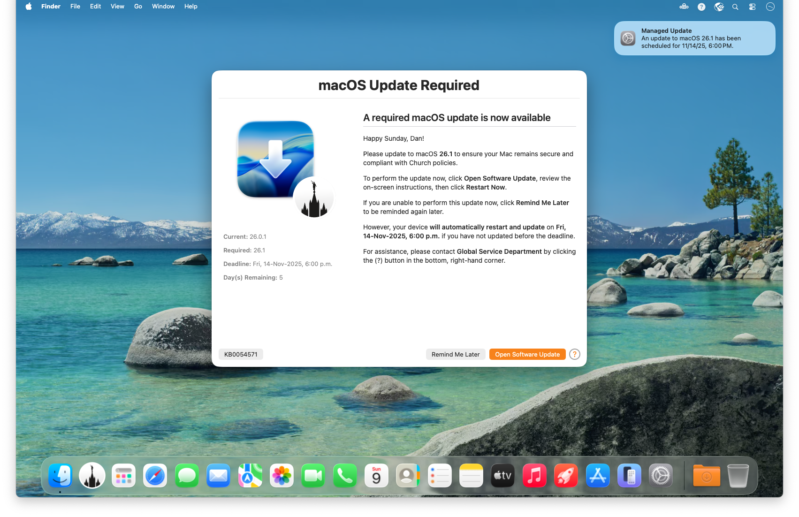
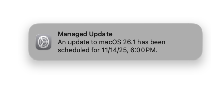
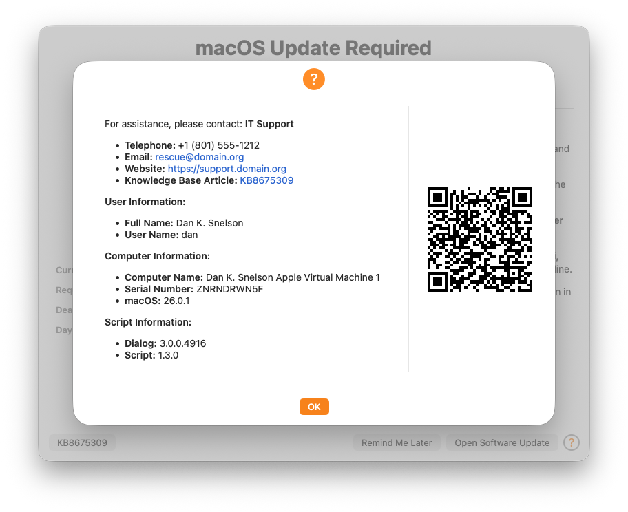

     

# DDM OS Reminder

> Mac Admins’ new favorite, MDM-agnostic, “set-it-and-forget-it” end-user messaging for Apple’s Declarative Device Management-enforced macOS update deadlines

## Overview

While Apple's Declarative Device Management (DDM) provides Mac Admins a powerful method to _enforce_ macOS updates, its built-in notification _tends to be too subtle_ for most Mac Admins:

**DDM OS Reminder** evaluates the most recent `EnforcedInstallDate` and `setPastDuePaddedEnforcementDate` entries in `/var/log/install.log`, then leverages a [swiftDialog](https://github.com/swiftDialog/swiftDialog/wiki)-enabled script and LaunchDaemon pair to dynamically deliver a more prominent end-user message of when the user's Mac needs to be updated to comply with DDM-configured OS version requirements:

## Features

> Mac Admins can configure `daysBeforeDeadlineBlurscreen` to control how many days before the DDM-specified deadline the screen blurs when displaying your customized message:

- **Customizable**: Easily customize the swiftDialog message’s title, message, icon, and button text to fit your organization’s needs by editing the provided [`DDM-OS-Reminder End-user Message.zsh`](DDM-OS-Reminder%20End-user%20Message.zsh) script. (See Documentation [Step A](https://snelson.us/2025/11/ddm-os-reminder-1-3-0/#A).)
- **Set-it-and-forget-it**: Once installed, the LaunchDaemon executes your customized [`ddmOSReminder.zsh`](ddmOSReminder.zsh) script, which automatically checks the installed version of macOS against the DDM-enforced macOS version twice daily and displays your customized message if an update is required. (See Documentation [Step B](https://snelson.us/2025/11/ddm-os-reminder-1-3-0/#B).)
- **Deadline Awareness**: Each time a DDM-enforced macOS version and deadline is updated via your MDM solution, the message will dynamically include an updated countdown to the deadline, creating a sense of urgency for end-users to update their Macs.
- **Tastefully Intrusive**: The message is designed to be informative without being overly disruptive — first checking for the user’s Display Sleep Assertions — allowing users to continue their work while being reminded of the need to update.
- **Easy Installation**: A new [`assembleDDMOSReminder.zsh`](Resources/assembleDDMOSReminder.zsh) script makes it easy to deploy via any MDM solution so you can quickly roll out across your entire organization.
- **Logging**: The script logs its actions to a specified log file, allowing administrators to monitor its activity and troubleshoot if necessary.

## Support

Community-supplied, best-effort support is available on the [Mac Admins Slack](https://www.macadmins.org/) (free, registration required) [#ddm-os-reminders](https://slack.com/app_redirect?channel=C09LVE2NVML) channel, or you can open an [issue](https://github.com/dan-snelson/DDM-OS-Reminder/issues).

## Deployment

[Continue reading …](https://snelson.us/ddm)# test-ddm-script

# test-ddm-script

## Run

sudo zsh ./ddm-test.sh
